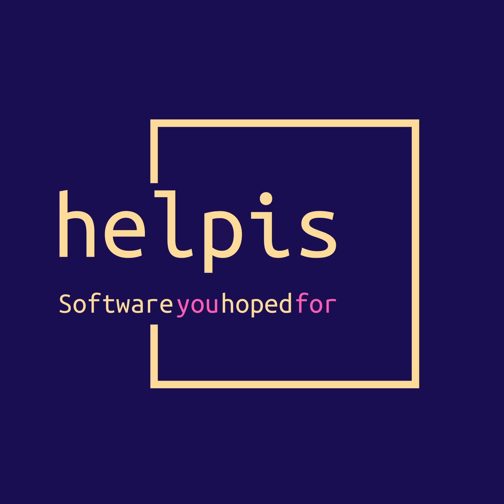

<!-- Improved compatibility of Back to top link: See: https://github.com/othneildrew/Best-README-Template/pull/73 -->
<a name="readme-top"></a>
<!--
*** Thanks for checking out the Best-README-Template. If you have a suggestion
*** that would make this better, please fork the repo and create a pull request
*** or simply open an issue with the tag "enhancement".
*** Don't forget to give the project a star!
*** Thanks again! Now go create something AMAZING! :D
-->


<!-- PROJECT SHIELDS -->
<!--
*** I'm using markdown "reference style" links for readability.
*** Reference links are enclosed in brackets [ ] instead of parentheses ( ).
*** See the bottom of this document for the declaration of the reference variables
*** for contributors-url, forks-url, etc. This is an optional, concise syntax you may use.
*** https://www.markdownguide.org/basic-syntax/#reference-style-links
-->
[![Contributors][contributors-shield]][contributors-url]
[![Forks][forks-shield]][forks-url]
[![Stargazers][stars-shield]][stars-url]
[![Issues][issues-shield]][issues-url]
[![License][license-shield]][license-url]
[![Donate][donate-shield]][donate-url]

<!-- PROJECT LOGO -->
<br />
<div align="center">
  <a href="https://github.com/helpisdev/ess-manning-rust.git">
    
  </a>

<h3 align="center">ess</h3>

  <p align="center">
    ESS two-factor authentication Linux module in Rust for the Manning Live Project.
    <br />
    <a href="https://github.com/helpisdev/ess-manning-rust.git/docs">
      <strong>Explore the docs »</strong>
    </a>
    <br />
    <br />
    <a href="https://github.com/helpisdev/ess-manning-rust.git/examples">View Demo</a>
    ·
    <a href="https://github.com/helpisdev/ess-manning-rust.git/issues">Report Bug</a>
    ·
    <a href="https://github.com/helpisdev/ess-manning-rust.git/issues">Request Feature</a>
  </p>
</div>

<!-- TABLE OF CONTENTS -->
<details>
  <summary>Table of Contents</summary>
  <ol>
    <li>
      <a href="#about-the-project">About The Project</a>
      <ul>
        <li><a href="#built-with">Built With</a></li>
      </ul>
    </li>
    <li>
      <a href="#getting-started">Getting Started</a>
      <ul>
        <li><a href="#prerequisites">Prerequisites</a></li>
        <li><a href="#installation">Installation</a></li>
      </ul>
    </li>
    <li><a href="#usage">Usage</a></li>
    <li><a href="#roadmap">Roadmap</a></li>
    <li><a href="#contributing">Contributing</a></li>
    <li><a href="#styleguides">Styleguides</a></li>
    <li><a href="#license">License</a></li>
    <li><a href="#contributor-license-agreement">Contributor License Agreement</a></li>
    <li><a href="#contact">Contact</a></li>
    <li><a href="#security">Security</a></li>
    <li><a href="#code-of-conduct">Code of Conduct</a></li>
    <li><a href="#acknowledgments">Acknowledgments</a></li>
  </ol>
</details>

<!-- ABOUT THE PROJECT -->
## About The Project
--------------------

<div style="text-align: center;">
  <a href="https://github.com/helpisdev/ess-manning-rust.git">
    
  </a>
</div>
ESS two-factor authentication Linux module in Rust for the Manning Live Project.

Consider adding badges for coverage, release version, code of conduct.

<p align="right">(<a href="#readme-top">Back to top</a>)</p>


### ___Built With:___

[![Dart][Dart]][dart-url] [![Flutter][Flutter]][flutter-url] [![Rust][Rust]][rust-url]

<p align="right">(<a href="#readme-top">Back to top</a>)</p>

<!-- GETTING STARTED -->
## Getting Started
------------------

This is an example of how you may give instructions on setting up your project locally.
To get a local copy up and running follow these simple example steps.

### Prerequisites

To install and build the project you have to have already installed __git__, __rust__, and __flutter__.
You can find instructions on how to install those on their respected websites:
- [git](https://git-scm.com/downloads)
- [rust](https://www.rust-lang.org/tools/install)
- [flutter](https://docs.flutter.dev/get-started/install)

### Installation

1. Clone the repo
   ```sh
   git clone https://github.com/helpisdev/ess-manning-rust.git.git
   ```
2. Change directory to flutter_code
		```
		cd ess
		```
3. Install Flutter packages
   ```sh
   flutter pub get
   ```
4. Install Rust packages
   ```sh
   cargo update
   ```
5. Follow the build instructions found in [BUILD.md](BUILD.md) to build for personal usage or development.

<p align="right">(<a href="#readme-top">Back to top</a>)</p>

<!-- USAGE EXAMPLES -->
## Usage
----------

Use this space to show useful examples of how a project can be used. Additional screenshots, code
examples and demos work well in this space. You may also link to more resources.

_For more examples, please refer to the [Documentation](https://docs.helpis.dev/flutter_code)_.

<p align="right">(<a href="#readme-top">Back to top</a>)</p>

<!-- ROADMAP -->
## Roadmap
----------

- [ ] Code Editing
  - [ ] Implement the code editor widget. This would involve setting up the text editing controller, applying syntax highlighting, and handling key events such as tab indentation and code formatting.
  - [ ] Implement file management functionality. This would involve creating a file tree view, adding the ability to create, rename, and delete files, and handling file saves and opens.
  - [ ] Integrate with the Flutter IntelliJ plugin. This would involve setting up a connection to the plugin, allowing users to run and debug their Flutter code from within the code editor.
  - [ ] Implement code completion and code analysis. This would involve using the Dart analysis server to provide code completion suggestions and error highlighting as users type.
  - [ ] Implement code formatting. This would involve using the dartfmt tool to automatically format code as it is saved.
  - [ ] Implement code search and replace. This would involve adding a search bar to the code editor and allowing users to search and replace text within the current file or across multiple files.
  - [ ] Implement code refactoring. This would involve adding functionality to rename variables, extract methods, and perform other common refactoring tasks.
  - [ ] Implement code navigation. This would involve adding the ability to jump to definitions and find references within the code editor.
  - [ ] Implement code folding. This would involve adding the ability to collapse and expand sections of code to make it easier to navigate large files.
  - [ ] Implement code snippet insertion. This would involve adding the ability to insert commonly used code snippets into the code editor.

See the [open issues](https://github.com/helpisdev/ess-manning-rust.git/issues) for a full list of proposed features (and known issues).

<p align="right">(<a href="#readme-top">Back to top</a>)</p>

<!-- STYLEGUIDES -->
## Styleguides
--------------

We try to be consistent in code style throughout our codebase and follow certain guidelines. Most of
them should comply with popular standards, but some might diverge due to company internal
preferences and conventions. Please read more about our code style if you are considering to
contribute to our products. You find general recommendations at [STYLEGUIDE.md](STYLEGUIDE.md), and
language-specific guidelines at the respective styleguides for each language used.

<p align="right">(<a href="#readme-top">Back to top</a>)</p>

<!-- CONTRIBUTING -->
## Contributing
---------------

Contributions are what make the open source community such an amazing place to learn, inspire, and
create. Any contributions you make are **greatly appreciated**.

Although our license *__is not__* approved by the OSI, it has a strong open-source spirit, while
still enabling us to survive as a company.

If you have a suggestion that would make this better, please fork the repo and create a pull
request. You can also simply open an issue with the tag “enhancement”.
Don't forget to give the project a star! Thanks again!

See [CONTRIBUTING.md](CONTRIBUTING.md) for more information.

<p align="right">(<a href="#readme-top">Back to top</a>)</p>

<!-- CONTRIBUTOR LICENSE AGREEMENT -->
## Contributor License Agreement
--------------

To contribute to our codebase, we require our contributors to sign our
[CLA](CONTRIBUTOR_LICENSE_AGREEMENT.md), in order to protect our competitive edge as a company.
Combined with our licensing policy, the CLA helps us to continue providing public access to our
codebase. We are really thankful for any contribution, and while we value and love _FOSS_ software,
we have chosen not to offer strictly FOSS software ourselves. This is due to the fact that we have
decided to actively not seek out any investors, in order to keep the company interests as solid as
possible. Making any profit that way should be magnitudes more difficult, so we made a compromise
in our licensing policy. We hope that anyone interested to contribute to our projects won't
hesitate to do so because of this policy. It's simply a matter of deciding to keep any third-party
interests outside of our software to keep our values and vision intact, while still being able to
keep doing this as a full-time job.

<p align="right">(<a href="#readme-top">Back to top</a>)</p>

<!-- LICENSE -->
## License
----------
Distributed under the BSL 1.1 License. See [LICENSE](LICENSE) for more information.

<p align="right">(<a href="#readme-top">Back to top</a>)</p>

<!-- CONTACT -->
## Contact
----------
Ilias Kapareliotis - company@helpis.dev

Project Link: [https://github.com/helpisdev/ess-manning-rust.git](https://github.com/helpisdev/ess-manning-rust.git)

<p align="right">(<a href="#readme-top">Back to top</a>)</p>

<!-- SECURITY -->
## Security
--------------

We take the security of our products very seriously and we try to be diligent about it. Please read
more about how to reach us for any security issues/concerns at [SECURITY.md](SECURITY.md).

<p align="right">(<a href="#readme-top">Back to top</a>)</p>

<!-- CODE OF CONDUCT -->
## Code of Conduct
--------------

We try to follow the standard Open Source Code of Conduct to the best of our abilities. Please read
more about it and how to contact us for any violation at [CODE_OF_CONDUCT.md](CODE_OF_CONDUCT.md).

<p align="right">(<a href="#readme-top">Back to top</a>)</p>

<!-- ACKNOWLEDGMENTS
## Acknowledgments
------------------

Thank you all for your amazing contributions and feedback, it is much appreciated. Special thanks goes to:

* []()
* []()
* []()

_If you think your name should be on this list, please contact us at company@helpis.dev._
<p align="right">(<a href="#readme-top">Back to top</a>)</p>
-->


<!-- MARKDOWN LINKS & IMAGES -->
<!-- https://www.markdownguide.org/basic-syntax/#reference-style-links -->
[contributors-shield]: https://img.shields.io/github/contributors/helpis-software/flutter_code.svg?style=for-the-badge
[contributors-url]: https://github.com/helpisdev/ess-manning-rust.git/graphs/contributors
[forks-shield]: https://img.shields.io/github/forks/helpis-software/flutter_code.svg?style=for-the-badge
[forks-url]: https://github.com/helpisdev/ess-manning-rust.git/network/members
[stars-shield]: https://img.shields.io/github/stars/helpis-software/flutter_code.svg?style=for-the-badge
[stars-url]: https://github.com/helpisdev/ess-manning-rust.git/stargazers
[issues-shield]: https://img.shields.io/github/issues/helpis-software/flutter_code.svg?style=for-the-badge
[issues-url]: https://github.com/helpisdev/ess-manning-rust.git/issues
[license-shield]: https://img.shields.io/badge/license-bsl1.1-235434?style=for-the-badge
[license-url]: https://github.com/helpisdev/ess-manning-rust.git/blob/main/LICENSE
[donate-shield]: https://img.shields.io/badge/€-donate-ff69b4.svg?maxAge=2592000&amp;style=for-the-badge
[donate-url]: https://www.paypal.me/username
[product-screenshot]: assets/image/raster/logo.png
[Dart]: https://img.shields.io/badge/dart-0175C2?style=for-the-badge&logo=dart&logoColor=white
[dart-url]: https://dart.dev/
[Flutter]: https://img.shields.io/badge/flutter-44d1fd?style=for-the-badge&logo=flutter&logoColor=08589c
[flutter-url]: https://flutter.dev/
[Rust]: https://img.shields.io/badge/rust-000000?style=for-the-badge&logo=rust&logoColor=white
[rust-url]: https://www.rust-lang.org/
